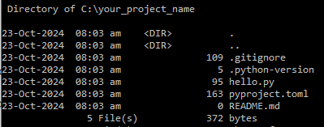
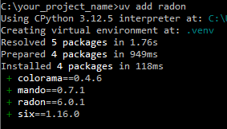

# Astral-sh UV

# ✋ Stop Using
-  ### pip
-   ### pip-tools 
-   ### pipx 
-   ### poetry 
-   ### pyenv 
-   ### virtualenv
-   ### and more ......

### You can now use 'UV', a single tool  to replace them all

#### Why, should we do so ... 

- ⚡️ 10-100x faster than pip
- 🐍 Installs and manages Python versions
- 🛠️ Runs and installs Python applications
- ❇️ Runs single-file scripts
- 🗂️ Provides comprehensive project management
- 🔩 Includes a pip-compatible interface
- 🏢 Supports Cargo-style workspaces
- 💾 Disk-space efficient
- ⏬ Installable without Rust or Python
- 💻 Supports macOS, Linux, and Windows
- 👌 UV is updated itself, if isntalled via standalone installer

It is as simple to use as you have, imagined

Let me guide you below, step by step

- Installation:
  -
  - Windows:
    - pip install uv
    - powershell -ExecutionPolicy ByPass -c "irm https://astral.sh/uv/install.ps1 | iex"

  - Linux
    - curl -LsSf https://astral.sh/uv/install.sh | sh
  - Mac:
    - curl -LsSf https://astral.sh/uv/install.sh | sh

### Now let's get in action:

**c:\>** `pip install uv` 
**c:\>** `uv help` (if help is required) 
**c:\>** `uv init your_project_name` (create your project) 
**c:\>** `cd your_project_name` (get inside your project folder) 
**c:\your_project_name>**  `(you are now inside your project folder)` 

By default below file structure is created for you 
inside your project folder (in your case c:\your_project_name> ) 

For the sake of an example add a python tool `radon` to your project

C:\your_project_name>

Use your favorite IDE and open your project
(I am using vs code)

C:\your_project_name>code .

you must find below contents, in your IDE

