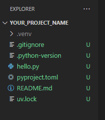

# Astral-sh UV

# ✋ Stop Using
-  ### pip
-   ### pip-tools 
-   ### pipx 
-   ### poetry 
-   ### pyenv 
-   ### virtualenv
-   ### and more ......

### You can now use 'UV', a single tool  to replace them all

#### Why, should we do so ... 

- ⚡️ 10-100x faster than pip
- 🐍 Installs and manages Python versions
- 🛠️ Runs and installs Python applications
- ❇️ Runs single-file scripts
- 🗂️ Provides comprehensive project management
- 🔩 Includes a pip-compatible interface
- 🏢 Supports Cargo-style workspaces
- 💾 Disk-space efficient
- ⏬ Installable without Rust or Python
- 💻 Supports macOS, Linux, and Windows
- 👌 UV is updated itself, if isntalled via standalone installer

It is as simple to use as you have, imagined

Let me guide you below, step by step

- Installation:
  -
  - Windows:
    - pip install uv
    - powershell -ExecutionPolicy ByPass -c "irm https://astral.sh/uv/install.ps1 | iex"

  - Linux
    - curl -LsSf https://astral.sh/uv/install.sh | sh
  - Mac:
    - curl -LsSf https://astral.sh/uv/install.sh | sh

### Now let's get in action:

c>pip install uv
c>uv help (if help is required)
c>uv init your_project_name (create your project)
c>cd your_project_name (get inside your project folder)
c:\your_project_name>  (you are now inside your project folder)

By default below file structure is created for you
in side your project folder (in your case c:\your_project_name> )

23-Oct-2024  08:03 am    <DIR>          .
23-Oct-2024  08:03 am    <DIR>          ..
23-Oct-2024  08:03 am               109 .gitignore
23-Oct-2024  08:03 am                 5 .python-version
23-Oct-2024  08:03 am                95 hello.py
23-Oct-2024  08:03 am               163 pyproject.toml
23-Oct-2024  08:03 am                 0 README.md
               5 File(s)            372 bytes
               2 Dir(s)  999,999,999,999 bytes free

For the sake of an example add a python tool 'radon' to your project

C:\your_project_name>uv add radon
Using CPython 3.12.5 interpreter at: C:\
Creating virtual environment at: .venv
Resolved 5 packages in 1.76s
Prepared 4 packages in 949ms
Installed 4 packages in 118ms
 + colorama==0.4.6
 + mando==0.7.1
 + radon==6.0.1
 + six==1.16.0

C:\your_project_name>

Now open your project folder, into your favorite IDE
(I am using vs code)

C:\your_project_name>code .

you must find below contents, in your IDE

